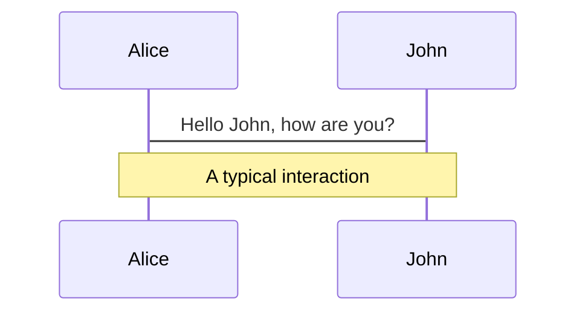
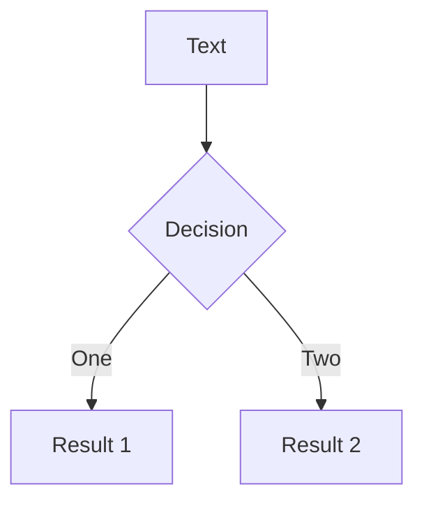
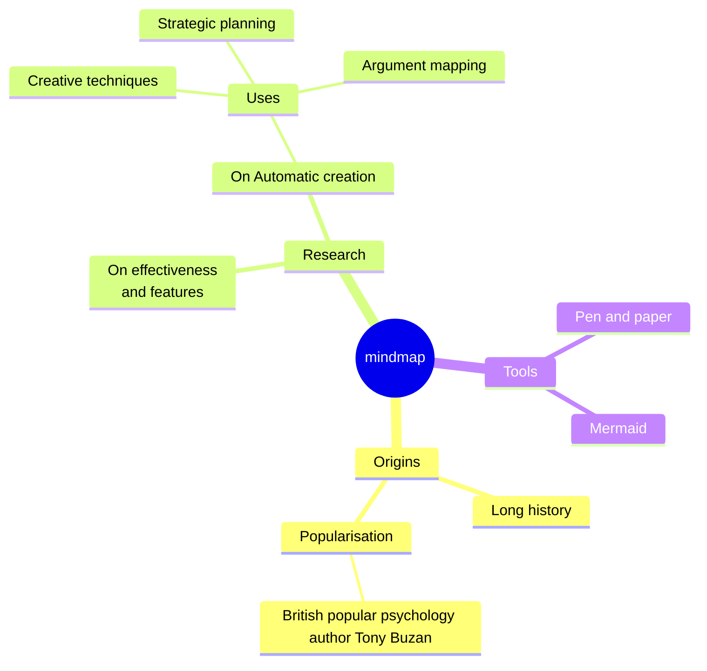
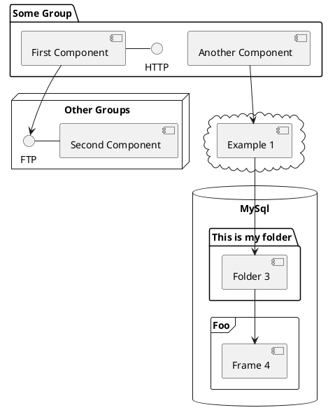

---
# try also 'default' to start simple
theme: dracula
# random image from a curated Unsplash collection by Anthony
# like them? see https://unsplash.com/collections/94734566/slidev
background: https://bs-uploads.toptal.io/blackfish-uploads/components/blog_post_page/content/cover_image_file/cover_image/907886/retina_1708x683_cover-0219-The10MistakesC-Waldek_img-343f93efd75d26a7d857e374cd8630fd.png
# some information about your slides, markdown enabled
title: Algorithmique Appliquée C#
info: |
  ## Slidev Starter Template
  Presentation slides for developers.

  Learn more at [Sli.dev](https://sli.dev)
# apply any unocss classes to the current slide
class: text-center
# https://sli.dev/custom/highlighters.html
highlighter: shiki
# https://sli.dev/guide/drawing
drawings:
  persist: false
# slide transition: https://sli.dev/guide/animations#slide-transitions
transition: slide-left
# enable MDC Syntax: https://sli.dev/guide/syntax#mdc-syntax
mdc: true
---

# Algorithmique Appliquée C#

Professeur Mounir BENDAHMANE

<div class="pt-12">
  <span @click="$slidev.nav.next" class="px-2 py-1 rounded cursor-pointer" hover="bg-white bg-opacity-10">
    Press Space for next page <carbon:arrow-right class="inline"/>
  </span>
</div>

<div class="abs-br m-6 flex gap-2">
  <button @click="$slidev.nav.openInEditor()" title="Open in Editor" class="text-xl slidev-icon-btn opacity-50 !border-none !hover:text-white">
    <carbon:edit />
  </button>
  <a href="https://github.com/slidevjs/slidev" target="_blank" alt="GitHub" title="Open in GitHub"
    class="text-xl slidev-icon-btn opacity-50 !border-none !hover:text-white">
    <carbon-logo-github />
  </a>
</div>

<!--
The last comment block of each slide will be treated as slide notes. It will be visible and editable in Presenter Mode along with the slide. [Read more in the docs](https://sli.dev/guide/syntax.html#notes)
-->

---
transition: fade-out
---

# Découverte du language C#

- 📝 **Class** - Une class peut etre considéré comme l'entrée ou la class principale d'un program.
- 🧑‍💻 **Méthode** - Une méthode Main c'est le point d'entrée d'un programme, elle est appelé au demarrage d'un programme.
- Pour compiler un programme, on utilise la commande *dotnet build* ou *dotnet run*,
- Une Méthode est représenté par sa signature: *modificateur* , *type de retour* , *nom de la methode*  , (*parametres*)
- Par exemple:
```csharp
 static void Main(string[] args)
```


<br>
<br>

<!--
You can have `style` tag in markdown to override the style for the current page.
Learn more: https://sli.dev/guide/syntax#embedded-styles
-->

<style>
h1 {
  background-color: #2B90B6;
  background-image: linear-gradient(45deg, #4EC5D4 10%, #146b8c 20%);
  background-size: 100%;
  -webkit-background-clip: text;
  -moz-background-clip: text;
  -webkit-text-fill-color: transparent;
  -moz-text-fill-color: transparent;
}
</style>

<!--
Here is another comment.
-->

---
transition: slide-up
level: 2
---

# Types de Variables

Il existe plusieurs types de variables en C#, 

## Types Valeur:

```csharp
int monEntier = 5;
```
```csharp
char myChar = 'a';
```
```csharp
bool isAdul = true;
```
```csharp
const double PI = 3.14;
```

<div class="mt-8 ">

## Types Référence

Inclues les types comme string et les objets.

</div>

<!-- https://sli.dev/guide/animations.html#click-animations -->

---
layout: two-cols
layoutClass: gap-16
---

## Conversion de Types:
Implicite; Automatique, sans perte d'information

Explicite: Necessite une syntaxe spécifique pour eviter les erreurs


::right::


---
layout: image-cetner

---

# Opérateurs Arythmétiques

En C# il existe plusieurs opératuers arythmetiques:

```csharp
 // Les opérateurs arithmétiques
        // + - * / %
        int x = 10 % 3;
        int y = 10 / 3;
        float z = 10 / (float)3.0; // Ceci est un cast explicite
        Console.WriteLine(x); 
        Console.WriteLine(y); 
        Console.WriteLine(z); 
```
ou alors: 
```csharp
        int x = 10 % 3;
        int y = 10 / 3;
        float z = 10 / (float)3.0; // Ceci est un cast explicite
        float a = 10 / 3.0f; // Ceci est un cast implicite
        Console.WriteLine(x); // 1
        Console.WriteLine(y); // 1
        Console.WriteLine(z); // 1
```
---
level: 2
---

# Opérateurs Booleans

Cet exemple illustre l'usage des opérateurs booléens en C#.

Ce code détermine si une personne peut conduire selon son âge, permis et statut d'émancipation:
```csharp
        int age = 14;
        bool hasDrivingLicense = false;
        bool isEmancipated = false;
        if (age >= 18 && hasDrivingLicense || isEmancipated)
        {
            Console.WriteLine("Vous pouvez conduire");
        }
        else if (age >= 18 && !hasDrivingLicense)
        {
            Console.WriteLine("Vous ne pouvez pas conduire");
        }
        else
        {
            Console.WriteLine("Vous ne pouvez pas conduire");
        }
```


---

# Structures de control : Les Boucles

<div grid="~ cols-1 gap-4">
<div>

Les boucles permettent d'exécuter des blocs de code de manière répétée. Trois types de boucles sont communément utilisés : `for`, `while`, et `do-while`.

<div class="flex flex-row mt-18">
<div>

## Boucle `for`

La boucle `for` est utilisée pour exécuter un bloc de code un nombre spécifique de fois.

```csharp
int i = 0;
for(i = 0; i < 5; i++){
    Console.WriteLine("Valeur de i: " + i);
}
```
</div>
<div class='flex flex-col ml-8'>

## Boucle `While`

La boucle `while` continue d'executer un bloc de code tant que la condition spécifiée reste vraie. Elle est utile lorsque le nomvre d'itérations ne sont pas conn.

```csharp
int i = 0;
while(i < 5){
    Console.WriteLine("Valeur de i: " + i);
    i++;
}
```
</div>
</div>
</div>
</div>

<!--
Presenter note with **bold**, *italic*, and ~~striked~~ text.

Also, HTML elements are valid:
<div class="flex w-full">
  <span style="flex-grow: 1;">Left content</span>
  <span>Right content</span>
</div>
-->

<!-- -->
---
class: px-20
---

# Boucle `do while`


</div>

Read more about [How to use a theme](https://sli.dev/themes/use.html) and
check out the [Awesome Themes Gallery](https://sli.dev/themes/gallery.html).

---

# Clicks Animations

You can add `v-click` to elements to add a click animation.

<div v-click>

This shows up when you click the slide:

```html
<div v-click>This shows up when you click the slide.</div>
```

</div>

<br>

<v-click>

The <span v-mark.red="3"><code>v-mark</code> directive</span>
also allows you to add
<span v-mark.circle.orange="4">inline marks</span>
, powered by [Rough Notation](https://roughnotation.com/):

```html
<span v-mark.underline.orange>inline markers</span>
```

</v-click>

<div mt-20 v-click>

[Learn More](https://sli.dev/guide/animations#click-animations)

</div>

---
preload: false
---

# Motions

Motion animations are powered by [@vueuse/motion](https://motion.vueuse.org/), triggered by `v-motion` directive.

```html
<div
  v-motion
  :initial="{ x: -80 }"
  :enter="{ x: 0 }">
  Slidev
</div>
```

<div class="w-60 relative mt-6">
  <div class="relative w-40 h-40">
    
    
    
  </div>

  <div
    class="text-5xl absolute top-14 left-40 text-[#2B90B6] -z-1"
    v-motion
    :initial="{ x: -80, opacity: 0}"
    :enter="{ x: 0, opacity: 1, transition: { delay: 2000, duration: 1000 } }">
    Slidev
  </div>
</div>

<!-- vue script setup scripts can be directly used in markdown, and will only affects current page -->
<script setup lang="ts">
const final = {
  x: 0,
  y: 0,
  rotate: 0,
  scale: 1,
  transition: {
    type: 'spring',
    damping: 10,
    stiffness: 20,
    mass: 2
  }
}
</script>

<div
  v-motion
  :initial="{ x:35, y: 40, opacity: 0}"
  :enter="{ y: 0, opacity: 1, transition: { delay: 3500 } }">

[Learn More](https://sli.dev/guide/animations.html#motion)

</div>

---

# LaTeX

LaTeX is supported out-of-box powered by [KaTeX](https://katex.org/).

<br>

Inline $\sqrt{3x-1}+(1+x)^2$

Block
$$ {1|3|all}
\begin{array}{c}

\nabla \times \vec{\mathbf{B}} -\, \frac1c\, \frac{\partial\vec{\mathbf{E}}}{\partial t} &
= \frac{4\pi}{c}\vec{\mathbf{j}}    \nabla \cdot \vec{\mathbf{E}} & = 4 \pi \rho \\

\nabla \times \vec{\mathbf{E}}\, +\, \frac1c\, \frac{\partial\vec{\mathbf{B}}}{\partial t} & = \vec{\mathbf{0}} \\

\nabla \cdot \vec{\mathbf{B}} & = 0

\end{array}
$$

<br>

[Learn more](https://sli.dev/guide/syntax#latex)

---

# Diagrams

You can create diagrams / graphs from textual descriptions, directly in your Markdown.

<div class="grid grid-cols-4 gap-5 pt-4 -mb-6">









</div>

[Learn More](https://sli.dev/guide/syntax.html#diagrams)

---
src: ./pages/multiple-entries.md
hide: false
---

---

# Monaco Editor

Slidev provides built-in Moanco Editor support.

Add `{monaco}` to the code block to turn it into an editor:

```ts {monaco}
import { ref } from 'vue'
import hello from './external'

const code = ref('const a = 1')
hello()
```

Use `{monaco-run}` to create an editor that can execute the code directly in the slide:

```ts {monaco-run}
function fibonacci(n: number): number {
  return n <= 1
    ? n
    : fibonacci(n - 1) + fibonacci(n - 2) // you know, this is NOT the best way to do it :P
}

console.log(Array.from({ length: 10 }, (_, i) => fibonacci(i + 1)))
```

---
layout: center
class: text-center
---

# Learn More

[Documentations](https://sli.dev) · [GitHub](https://github.com/slidevjs/slidev) · [Showcases](https://sli.dev/showcases.html)
 -->

